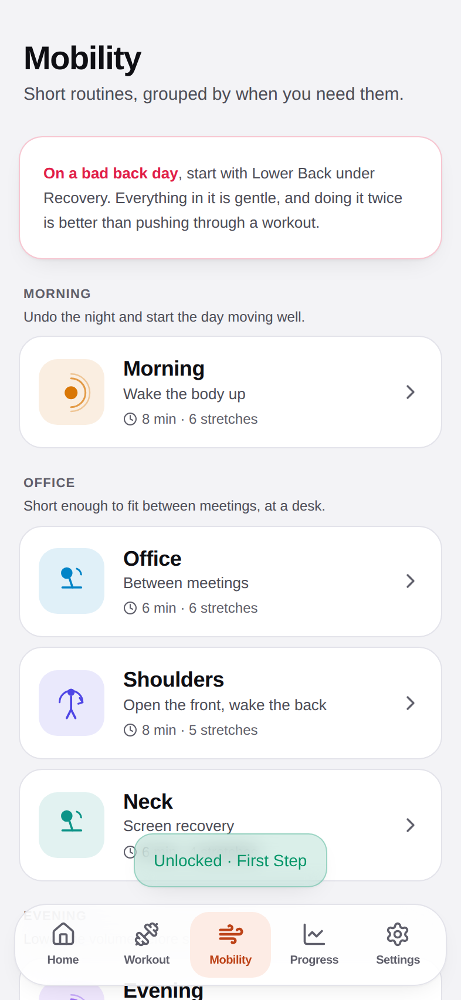
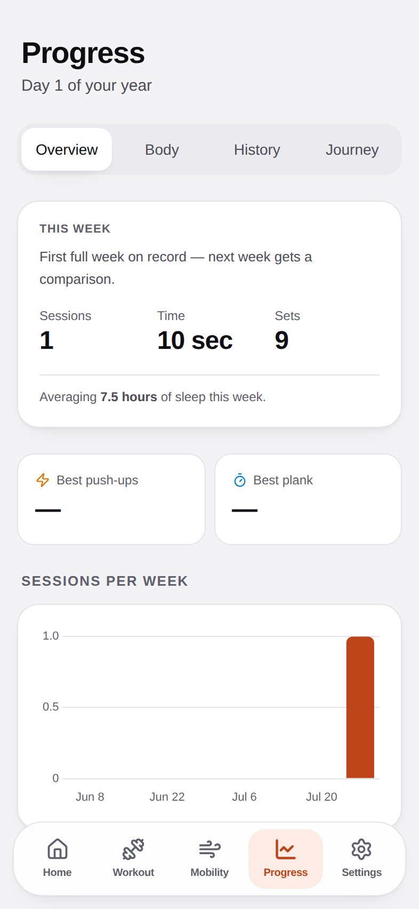
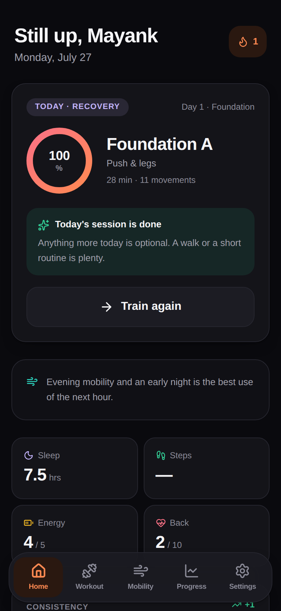
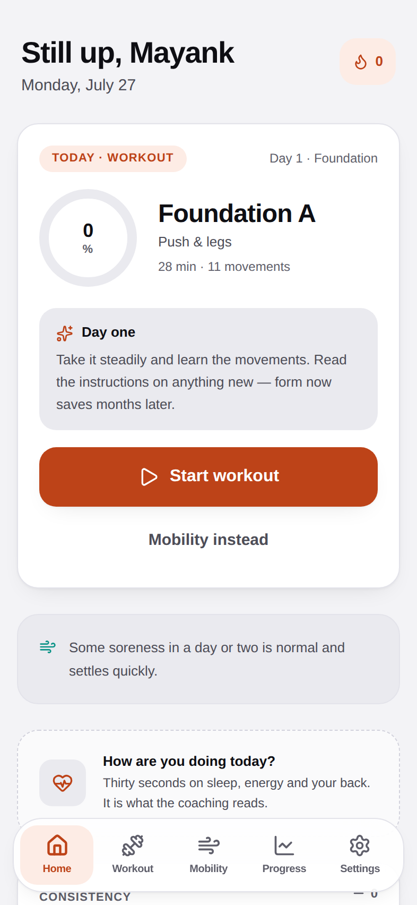

# Arohan

Mayank's health and exercise tracker — an offline-first PWA for one person, built to run
on an iPad for a year.

*Ārohaṇa* (आरोहण) means the ascent.

**Live:** https://mayankchittoraops.github.io/Arohan/ — open in Safari, then
**Share → Add to Home Screen**.

---

## What it looks like

| Today's focus | Session runner | Circular rest timer |
| --- | --- | --- |
|  |  |  |

| Finish celebration | Mobility, by category | Progress |
| --- | --- | --- |
|  |  |  |

| Dark mode | Empty check-in | iPad |
| --- | --- | --- |
|  |  |  |

---

## What it does

A twelve-month programme built around four goals: exercise consistently, calm the lower
back, build strength, and be able to see the progress.

- **Home** — Today's Focus (Workout / Mobility / Recovery / Rest), a coaching read on it,
  the habit checklist, consistency over the last fortnight, and a daily check-in for
  sleep, steps, energy and back pain. Starting today's session is one tap.
- **Workout** — a guided runner with per-set logging, a circular rest timer, timed holds,
  form instructions and cues, and a completion celebration. The session autosaves on every
  tap, so closing the app mid-set loses nothing.
- **Mobility** — eight routines grouped into Morning, Office, Evening and Recovery. Every
  stretch shows its duration and target muscles.
- **Progress** — this week against last, sessions per week, a back-pain trend that says
  which way it is going, weight and waist, weekly photos, full session history, and the
  journey timeline with eighteen achievements.
- **Settings** — theme, equipment, reminder times, and JSON export/import.

---

## Design decisions worth knowing

**Everything is local.** All data lives in IndexedDB via Dexie. There is no server, no
account, and no analytics. The only way data moves between devices is the JSON backup in
Settings — export regularly, because clearing site data takes everything with it.

**The coaching is deterministic.** Ten ordered rules over sleep, energy, back pain, time
since the last session, that session's effort and your streak. No model, no randomness,
no network. The same inputs always give the same advice, because advice that changes when
you reload is not advice. Two principles are baked into the rule order: pain outranks the
plan, and it never guilts you for time off.

**The programme adapts to your equipment.** You start with a mat and bands. Tick
"Adjustable dumbbells" or "Pull-up bar" in Settings when they arrive and sessions
substitute the right movements automatically, falling back down the chain
(dumbbell → band → bodyweight) when something is missing.

**Progression is automatic, phases are not.** Within a phase, volume climbs over a
three-weeks-on / one-week-deload cycle. Moving between phases always asks first.

**The core work is built for a sore back.** No loaded sit-ups or weighted spinal flexion
anywhere in the 84-movement library. Trunk training is bracing work — planks, side planks,
bird dogs, dead bugs, curl-ups and Pallof presses — and the hip hinge is drilled from day
one. Every movement carries primary and secondary muscles, a difficulty, and both an
easier and a harder variation.

**Illustrations are placeholders by design.** Each movement gets a generated stick-figure
glyph rather than a photo, so the whole app installs and works offline with no image
assets to fetch. Replacing them properly is on the Phase 3 roadmap.

---

## Quality bar

Measured against a production build with headless Chromium:

| | Desktop | Mobile |
| --- | --- | --- |
| Performance | **100** | 88–92 * |
| Accessibility | **100** | **100** |
| Best Practices | **100** | **100** |
| SEO | **100** | **100** |

\* The mobile figure is noisy in the build container — total blocking time swung 230–330 ms
across runs on identical code, against 10 ms on desktop. It needs re-measuring on real
hardware; see [Known Issues](docs/KNOWN_ISSUES.md).

Every text colour clears WCAG AA 4.5:1 in both themes. Pinch-zoom works. Verified end to
end at 393×852 and 834×1112 with no console errors, no failed requests and no horizontal
overflow on any tab.

---

## Running it

```bash
npm install
npm run dev        # http://localhost:5173/Arohan/
npm run build      # type-check, lint-clean build into dist/
npm run preview
npx tsc -b         # type check on its own
npx oxlint src     # lint
```

## Deploying

Pushing to `main` runs `.github/workflows/deploy.yml`, which type-checks, lints, builds and
publishes `dist/` to GitHub Pages.

The app is served from `/Arohan/`. That base must match the repository name exactly,
capital A included — Pages mounts a project site at the repo's path and URL path segments
are case-sensitive, so a lowercase base would leave every asset link pointing nowhere.
Change `base` in `vite.config.ts` if the repository is ever renamed.

The workflow copies `index.html` to `404.html` because GitHub Pages has no SPA rewrite —
that is what makes a deep link work on a cold load.

---

## Project layout

```
src/
  components/   design system — Button, Card, StatCard, ExerciseCard,
                CircularTimer, BottomSheet, Modal, ProgressRing, ErrorBoundary
  features/
    home/       today's focus, coaching, habits, check-in, onboarding
    workout/    session runner, rest timer, celebration, plan view
    mobility/   categorised routine list and detail
    progress/   weekly summary, body, history, journey
    settings/   preferences, equipment, reminders, backup
  storage/      Dexie schema, repositories, session model, stats, backup
  hooks/        settings, stats, coach, timers, theme, reminders, wake lock
  data/         exercise library, programme, coaching rules, routines, quotes
  lib/          dates, formatting, image handling, motion tokens
scripts/        procedural PWA icon generator
docs/           technical report, changelog, known issues, roadmap, screenshots
```

## Documentation

- [Changelog](CHANGELOG.md) — what changed in Phase 2 and why
- [Technical Report](docs/TECHNICAL_REPORT.md) — architecture, schema, measurements
- [Known Issues](docs/KNOWN_ISSUES.md) — honest current state
- [Phase 3 Roadmap](docs/PHASE_3_ROADMAP.md) — what to do next

## Notes

- `npm audit` reports two advisories that do not apply here: a React Router RSC-mode CSRF
  issue (this is a client-only SPA with no server actions) and a DoS in a transitive
  build-time dependency of `vite-plugin-pwa`. Both fixes require breaking major bumps.
- Reminders are local notifications scheduled while the app is open. There is no push
  server. iPadOS only delivers them once the app is installed to the Home Screen.
- Run `node scripts/generate-icons.mjs` after changing the app mark.
