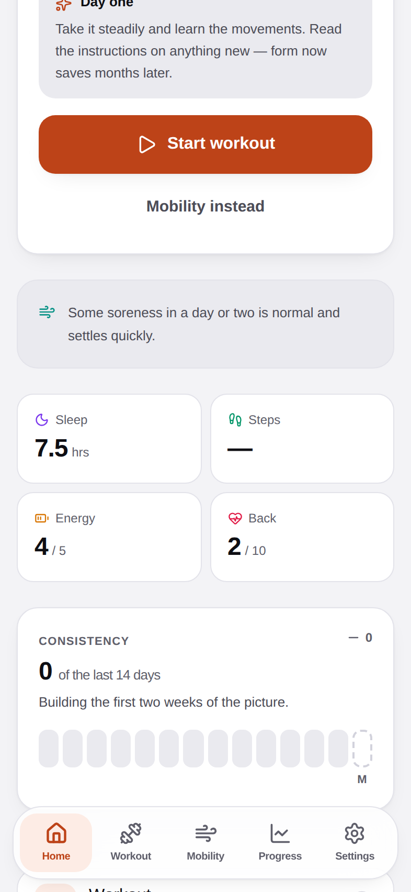
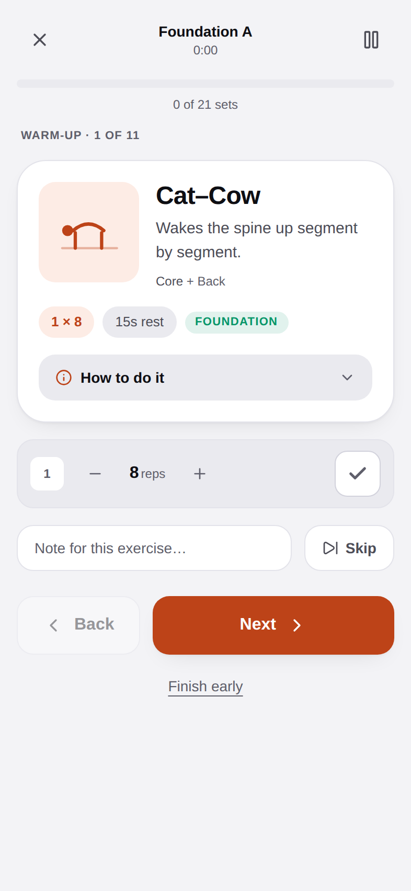
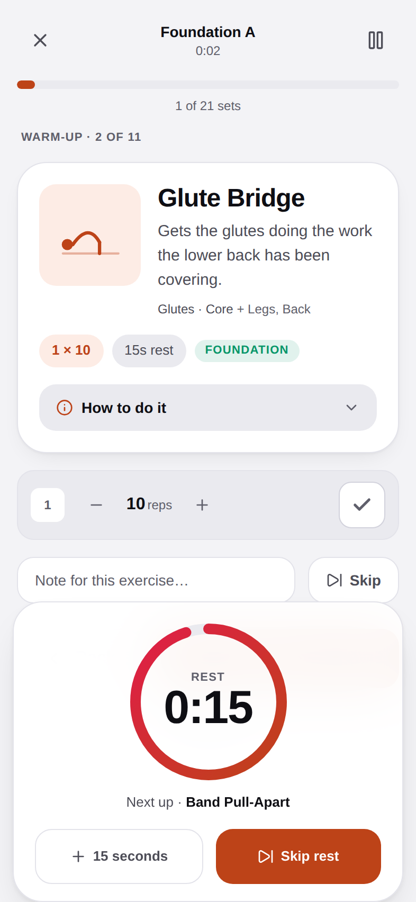
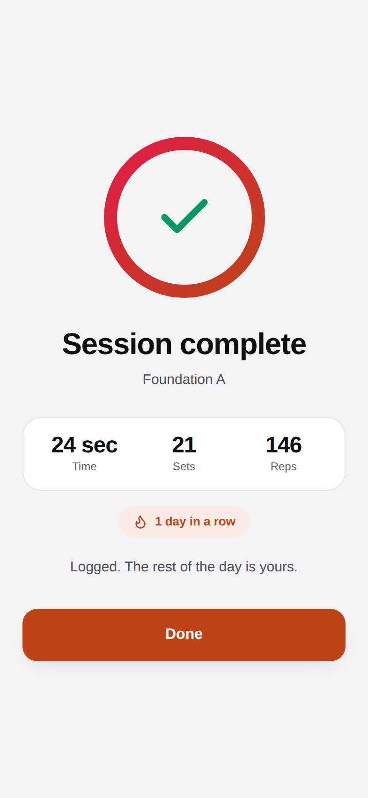
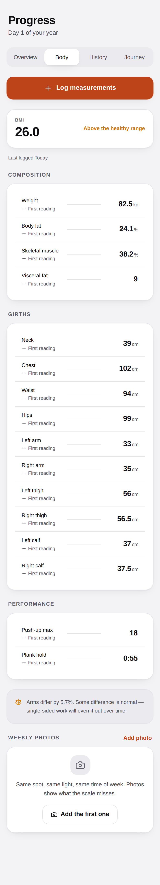
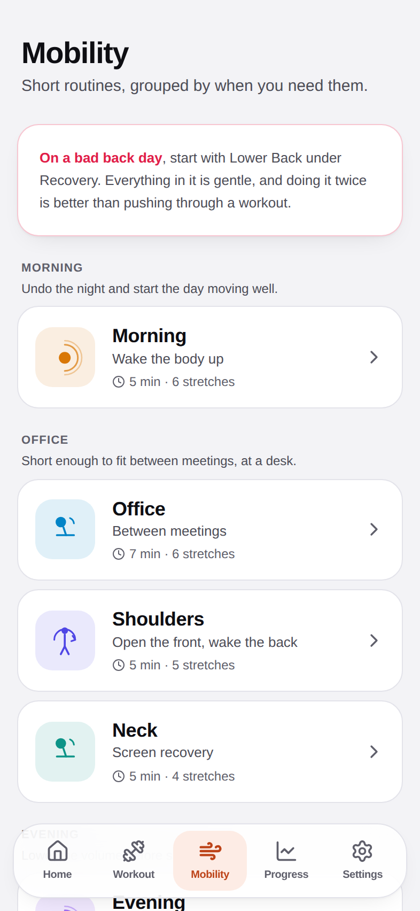
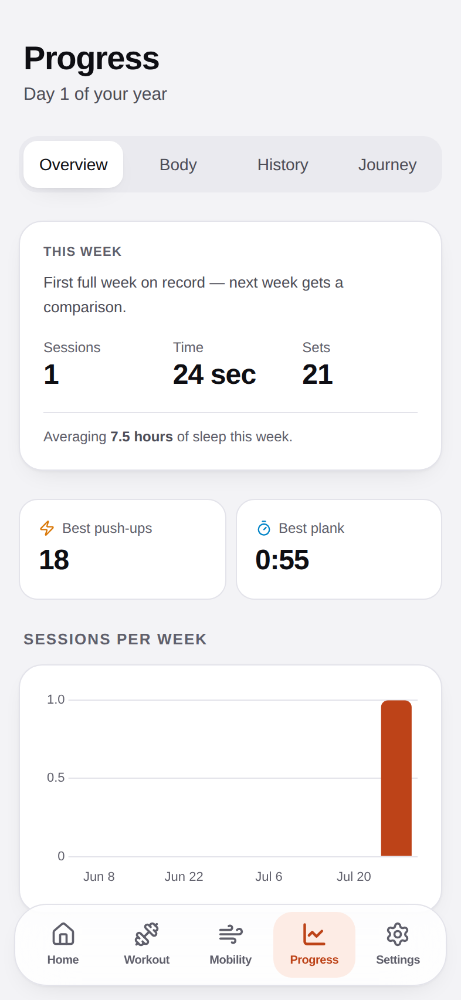
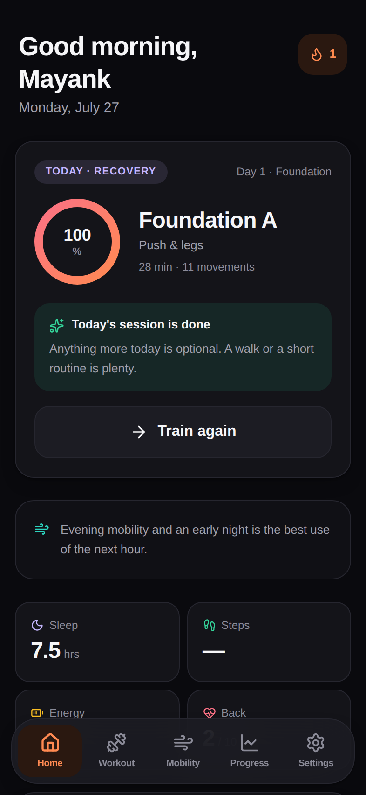
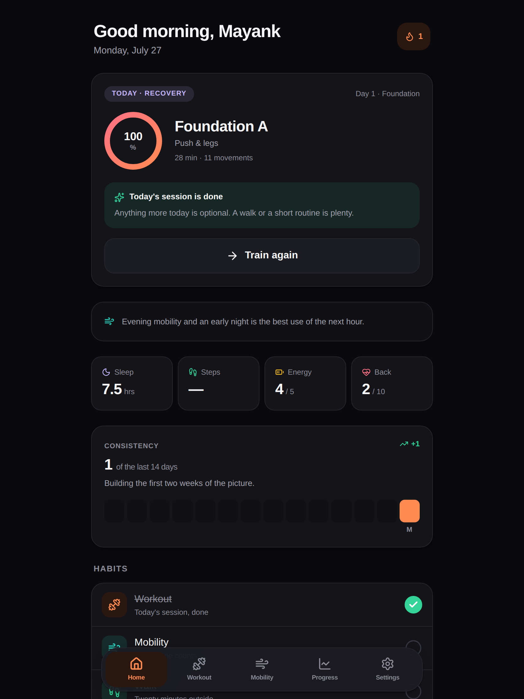

# Arohan

Mayank's health and exercise tracker — an offline-first PWA for one person, built to run
on an iPad for a year.

*Ārohaṇa* (आरोहण) means the ascent.

**Version 1.0 Beta** · [Release Notes](docs/RELEASE_NOTES.md)

**Live:** https://mayankchittoraops.github.io/Arohan/ — open in Safari, then
**Share → Add to Home Screen**.

---

## What it looks like

| Today's focus | Session runner | Circular rest timer |
| --- | --- | --- |
|  |  |  |

| Finish celebration | Body metrics and trends | Mobility, by category |
| --- | --- | --- |
|  |  |  |

| Progress | Dark mode | iPad |
| --- | --- | --- |
|  |  |  |

---

## What it does

A twelve-month programme built around four goals: exercise consistently, calm the lower
back, build strength, and be able to see the progress.

- **Home** — Today's Focus (Workout / Mobility / Recovery / Rest), a coaching read on it,
  the habit checklist, consistency over the last fortnight, and a daily check-in for sleep,
  steps, energy and back pain. Starting today's session is one tap from a cold open.
- **Workout** — a guided runner with per-set logging, a circular rest timer, timed holds,
  form instructions and cues, and a completion celebration. The session autosaves on every
  tap, so closing the app mid-set loses nothing.
- **Mobility** — eight routines grouped into Morning, Office, Evening and Recovery. Every
  stretch shows its duration and target muscles, and routines adapt to your equipment.
- **Progress** — this week against last, sessions per week, a back-pain trend that says
  which way it is going, **sixteen body metrics with BMI and asymmetry**, weekly photos,
  full session history, and the journey timeline with eighteen achievements.
- **Settings** — theme, height, units, equipment, reminder times, storage state, and JSON
  export/import.

### Body tracking

Sixteen metrics, all optional, grouped so the form is quick to fill:

| Group | Metrics |
| --- | --- |
| Composition | Weight, Body fat %, Skeletal muscle %, Visceral fat |
| Girths | Neck, Chest, Waist, Hips, Left/Right arm, Left/Right thigh, Left/Right calf |
| Performance | Push-up max, Plank hold |

Each shows its latest value, how it moved, and a sparkline — a direction rather than a chart
to interpret. BMI is derived from weight and height and shown as a band. Left/right
differences of 3% or more are called out, which is why left and right are separate fields
rather than one averaged number.

---

## Design decisions worth knowing

**Everything is local.** All data lives in IndexedDB via Dexie. There is no server, no
account, and no analytics. The only way data moves between devices is the JSON backup in
Settings — export regularly, because clearing site data takes everything with it. The app
requests a storage-persistence grant at launch and shows whether the browser gave it.

**The coaching is deterministic, and there is no AI anywhere.** Ten ordered rules over
sleep, energy, back pain, time since the last session, that session's effort and your
streak. No model, no randomness, no network. The same inputs always give the same advice,
because advice that changes when you reload is not advice. Two principles are baked into the
rule order: pain outranks the plan, and it never guilts you for time off.

**The programme adapts to your equipment.** You start with a mat and bands. Tick "Adjustable
dumbbells" or "Pull-up bar" in Settings when they arrive and sessions substitute the right
movements automatically, falling back down the chain (dumbbell → band → bodyweight) when
something is missing. Mobility routines resolve the same way.

**Progression is automatic, phases are not.** Within a phase, volume climbs over a
three-weeks-on / one-week-deload cycle. Moving between phases always asks first.

**The core work is built for a sore back.** No loaded sit-ups or weighted spinal flexion
anywhere in the 83-movement library. Trunk training is bracing work — planks, side planks,
bird dogs, dead bugs, curl-ups and Pallof presses — and the hip hinge is drilled from day
one. Every movement carries primary and secondary muscles, a difficulty, and both an easier
and a harder variation.

**Derived values are never stored.** Streaks, personal bests, weekly summaries, trends and
BMI are recomputed from history on read. A stored derived value is one that can disagree
with its inputs.

**Illustrations are placeholders by design.** Each movement gets a generated stick-figure
glyph rather than a photo, so the whole app installs and works offline with no image assets
to fetch.

---

## Quality bar

**128 tests** over the logic that decides things — the coach, streaks, progression,
substitution, dates, trends, session mechanics, backup round-trips and the schema migration.
They run in about a second, and CI runs them before every deploy.

Beyond that, the production build was driven in a real browser: **39 checks, all passing**,
covering a live v1 → v2 database migration, the workout engine, resume after closing the
tab, all sixteen health fields, backup export/reset/restore, offline boot and cold deep
links, and zero horizontal overflow at four viewport sizes.

Lighthouse, against a production build with headless Chromium:

| | Desktop | Mobile |
| --- | --- | --- |
| Performance | **100** | 93 * |
| Accessibility | **100** | **100** |
| Best Practices | **100** | **100** |
| SEO | **100** | **100** |

\* The mobile figure is noisy in the build container — total blocking time swung 210–330 ms
across runs on identical code, against 0 ms on desktop. It needs re-measuring on real
hardware; see [Known Issues](docs/KNOWN_ISSUES.md).

Every text colour clears WCAG AA 4.5:1 in both themes. Pinch-zoom works. Framer Motion
honours `prefers-reduced-motion` at the root.

---

## Running it

```bash
npm install
npm run dev        # http://localhost:5173/Arohan/
npm run build      # type-check then production build into dist/
npm run preview
npm test           # 128 tests, Vitest
npm run check      # tsc -b && oxlint src && vitest run
```

## Deploying

Pushing to `main` runs `.github/workflows/deploy.yml`, which type-checks, lints, **tests**,
builds and publishes `dist/` to GitHub Pages.

The app is served from `/Arohan/`. That base must match the repository name exactly, capital
A included — Pages mounts a project site at the repo's path and URL path segments are
case-sensitive, so a lowercase base would leave every asset link pointing nowhere. Change
`base` in `vite.config.ts` if the repository is ever renamed.

The workflow copies `index.html` to `404.html` because GitHub Pages has no SPA rewrite —
that is what makes a deep link work on a cold load.

---

## Project layout

```
src/
  components/   design system — Button, Card, StatCard, ExerciseCard,
                CircularTimer, Sparkline, BottomSheet, Modal, ErrorBoundary
  features/
    home/       today's focus, coaching, habits, check-in, onboarding
    workout/    session runner, rest timer, celebration, plan view
    mobility/   categorised routine list and detail
    progress/   weekly summary, body metrics, history, journey
    settings/   preferences, equipment, reminders, storage, backup
  storage/      Dexie schema and migration, repositories, session, stats, trends, backup
  hooks/        settings, stats, coach, timers, theme, reminders, wake lock, storage
  data/         exercise library, programme, coaching rules, routines, metrics
  lib/          dates, formatting, image handling, motion tokens
scripts/        procedural PWA icon generator
docs/           reports, schema, guides, release notes, screenshots
```

Layering rule: `components/` never touches storage; `data/` is pure and imports neither
React nor `storage/`; `storage/` imports no React. That is what makes the coaching engine
and the programme logic testable without a browser.

## Documentation

| Document | For |
| --- | --- |
| [User Guide](docs/USER_GUIDE.md) | How to use every screen, and the habits that make it work |
| [Backup Guide](docs/BACKUP_GUIDE.md) | Export, restore, and moving to a new device |
| [Release Notes](docs/RELEASE_NOTES.md) | What shipped in v1.0 Beta |
| [Technical Report](docs/TECHNICAL_REPORT.md) | Stack, features, storage, tests, performance |
| [Architecture](docs/ARCHITECTURE.md) | Diagrams, layering, the data-flow loop |
| [Database Schema](docs/DATABASE_SCHEMA.md) | Every stored field, and how to add a version |
| [Known Issues](docs/KNOWN_ISSUES.md) | Honest current state |
| [Changelog](CHANGELOG.md) | Change history by phase |
| [Phase 3 Roadmap](docs/PHASE_3_ROADMAP.md) | Ideas parked, with reasons |

## Notes

- `npm audit` reports two advisories that do not apply here: a React Router RSC-mode CSRF
  issue (this is a client-only SPA with no server actions) and a DoS in a transitive
  build-time dependency of `vite-plugin-pwa`. Both fixes require breaking major bumps.
- Reminders are local notifications scheduled while the app is open. There is no push
  server. iPadOS only delivers them once the app is installed to the Home Screen.
- Run `node scripts/generate-icons.mjs` after changing the app mark.

---

Version 1.0 Beta is feature complete. Further development should be driven by what twelve
months of actual daily use exposes — not by a plan written before it was used.
