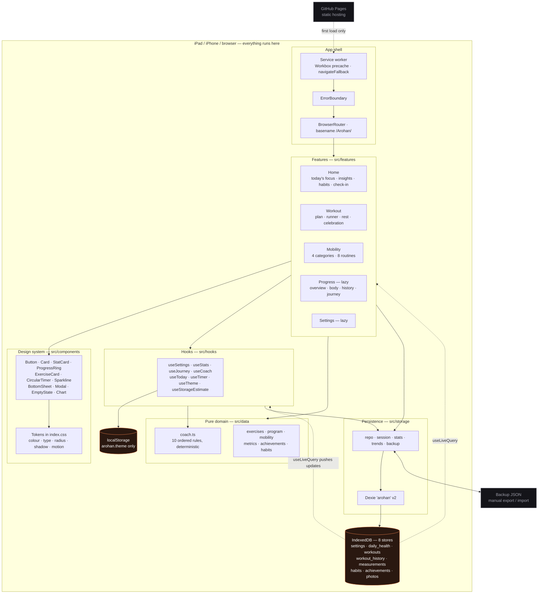
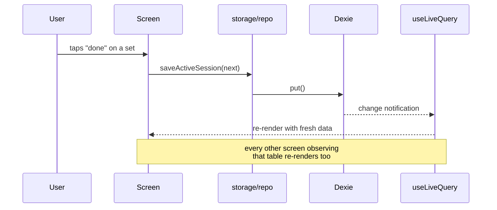
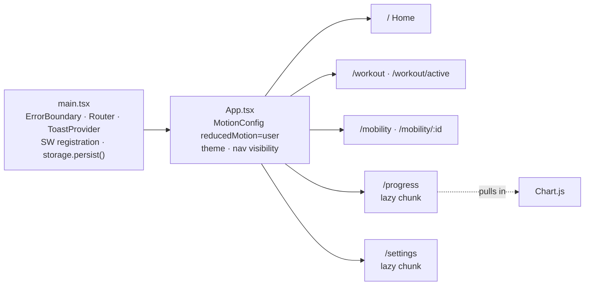
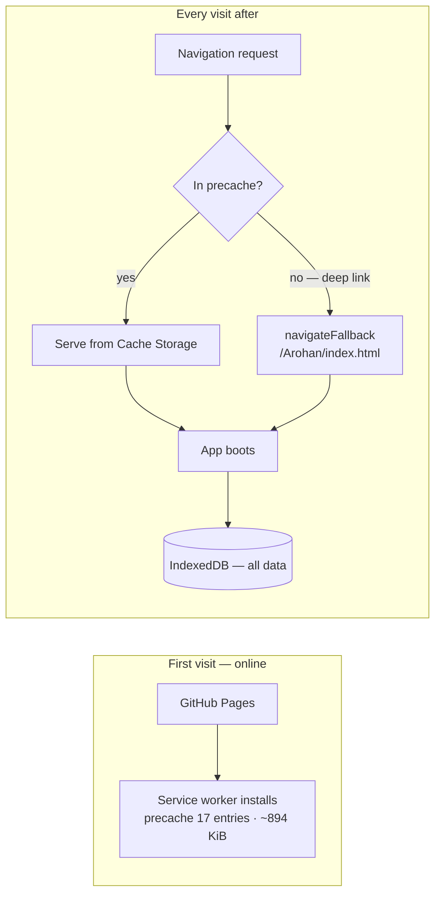
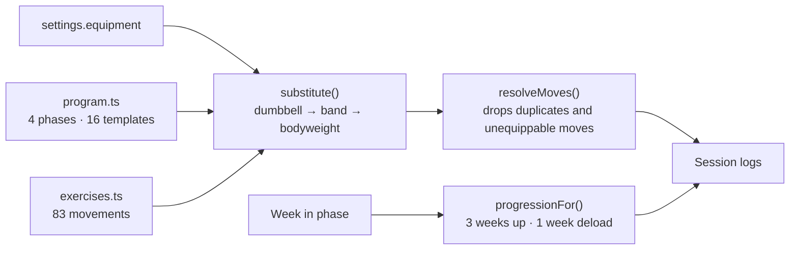

# Arohan — Architecture

**Version 1.0 Beta** · One user, one device, no server.

Arohan is a client-only Progressive Web App. Everything below runs inside the browser tab.
There is no backend, no authentication, no runtime network request, and no state library.

---

## The whole system

**The only two exits from the device** are the manual JSON backup and the initial download
of the app itself. Nothing is transmitted at runtime.

---

## Layers and the rule between them

| Layer | Directory | May import | Must not import |
| --- | --- | --- | --- |
| Pure domain | `src/data` | `src/lib` | React, `src/storage`, `src/components` |
| Persistence | `src/storage` | `src/data`, `src/lib` | React, `src/components`, `src/features` |
| Hooks | `src/hooks` | everything below | `src/features` |
| Design system | `src/components` | `src/lib` | `src/storage`, `src/features` |
| Features | `src/features` | everything | — |

The rule earns its keep in one place in particular: the coaching engine lives in `data/`
because it is a pure function of its inputs, which is exactly what makes it testable
without a database or a renderer. `coach.test.ts` has 20 assertions and needs no harness at
all.

---

## The one data loop

There is no store, no dispatcher, no action, and no cache to invalidate. **The database is
the state.** A write anywhere re-renders every dependent screen, because `useLiveQuery`
subscribes to the tables a query touches.

Two consequences worth stating:

- **Derived values are never stored.** Streaks, personal bests, weekly summaries, metric
  trends and BMI are recomputed from history on read (`storage/stats.ts`,
  `storage/trends.ts`, `data/metrics.ts`). A stored derived value is one that can disagree
  with its inputs.
- **Writes that read first must be serialised.** In-session mutations are read-modify-write
  over the whole session row, so `useActiveSession` queues them through a promise chain.
  Skipping this cost us a lost-update bug in Phase 1 where ticking a set and advancing the
  index raced and the counter never moved off "0 of 21".

---

## Rendering and routes

Progress and Settings are behind `React.lazy`, which keeps Chart.js — the single largest
dependency — off the critical path entirely. The Body screen deliberately uses an inline
SVG `Sparkline` rather than Chart.js, so per-metric trends cost nothing.

`MotionConfig reducedMotion="user"` sits at the root, so Framer Motion honours the OS
reduce-motion setting on every animation in the app rather than only the CSS ones.

---

## Offline

After the first load, the network is never needed. Deep links work cold and offline because
of `navigateFallback`; they work on GitHub Pages *online* because CI copies `index.html` to
`404.html`, Pages having no SPA rewrite of its own.

`registerType: 'autoUpdate'` means a new deploy is picked up on the next launch without a
prompt — appropriate for a single-user app where there is no one to explain an update
dialog to.

---

## Content pipeline

Templates name an ideal movement; `substitute()` walks the fallback chain down to whatever
the user actually owns, and `resolveMoves()` removes anything that ends up duplicated or
unequippable. The same resolution runs for mobility routines, which is why a user without
bands never sees a band pass-through in the Shoulders routine.

Progression is automatic within a phase; **moving between phases always asks first.**

---

## Coaching

`data/coach.ts` is a pure function: no React, no storage, no clock, no randomness.

**Inputs** — scheduled kind, trained today, sleep hours, energy, back pain, days since the
last session, that session's RPE, current streak, journey day.

**Output** — focus, verdict (`go` / `ease` / `swap` / `rest` / `done`), headline, detail,
recovery suggestion, encouragement, and optionally a routine to swap to.

Ten ordered rules, first match wins, so the behaviour reads top to bottom. Two principles
are enforced by the ordering rather than by prose:

1. **Pain outranks the plan.** Back pain at 6 or above swaps the session for the Lower Back
   routine regardless of what the calendar says.
2. **It never guilts you.** Four days away yields *"Nothing is lost. Picking it up again is
   the hard part, and you just did."*

Encouragement is drawn from five streak bands of twelve lines each, indexed by journey day
— so it varies over weeks but never changes on a refresh. Same inputs, same advice, always.
No model is involved anywhere in Arohan.

---

## What is deliberately absent

| Not here | Why |
| --- | --- |
| Backend, sync, accounts | One user, one device. Sync is the feature that would require every other one. |
| State management library | The database is the store, and `useLiveQuery` is the subscription. |
| Runtime network calls | Would break the offline guarantee. |
| Stored derived values | They can disagree with their inputs. |
| AI or any model | Advice that changes when you reload is not advice. |
| Nutrition, social, watch integration | Out of scope by design, not by omission. |

---

Related: [Technical Report](TECHNICAL_REPORT.md) · [Database Schema](DATABASE_SCHEMA.md) ·
[Known Issues](KNOWN_ISSUES.md)
