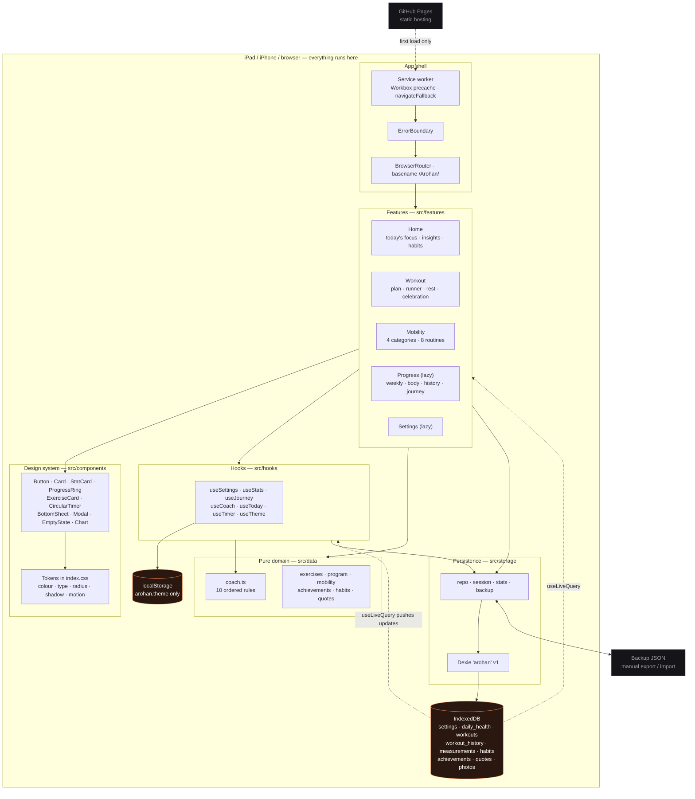

# Arohan — Technical Report

**Phase:** 2 (Product Polish) · **Date:** 27 July 2026 · **Status:** deployed to GitHub Pages

An offline-first Progressive Web App for a single user's twelve-month health and exercise
programme. No backend, no authentication, no external runtime requests.

Companion documents: [CHANGELOG](../CHANGELOG.md) ·
[Known Issues](KNOWN_ISSUES.md) · [Phase 3 Roadmap](PHASE_3_ROADMAP.md)

---

## 1. Folder structure

```
Arohan/
├── .github/workflows/deploy.yml      CI: type-check → lint → build → GitHub Pages
├── .oxlintrc.json                    correctness as errors, react-hooks rules on
├── index.html                        pre-paint theme script, PWA meta, safe-area viewport
├── vite.config.ts                    base=/Arohan/, PWA manifest
├── CHANGELOG.md
├── docs/
│   ├── TECHNICAL_REPORT.md           this document
│   ├── KNOWN_ISSUES.md
│   ├── PHASE_3_ROADMAP.md
│   └── screenshots/                  11 captures, iPhone and iPad, light and dark
├── scripts/generate-icons.mjs        procedural PNG icon generator (zlib, no deps)
├── public/icons/                     favicon.svg, apple-touch-icon, 192/512/512-maskable
└── src/                              10,908 lines
    ├── main.tsx                      root, ErrorBoundary, Router, ToastProvider, SW
    ├── App.tsx                       routes, lazy boundaries, theme, nav visibility
    ├── index.css                     design tokens: colour, type, radius, shadow, motion
    │
    ├── components/                   1,676 lines — presentational, no data access
    │   ├── BottomNav · Page · Card · Button · Icon
    │   ├── ExerciseCard              row + hero forms, muscles, difficulty
    │   ├── CircularTimer             countdown as a depleting ring
    │   ├── Overlay                   BottomSheet + Modal, one implementation
    │   ├── ErrorBoundary             render-error recovery
    │   ├── ProgressRing · StatCard · Chart · Fields · Feedback · ExerciseGlyph
    │
    ├── features/                     3,757 lines
    │   ├── home/                     HomePage, TodayCard, Insights, HabitChecklist,
    │   │                             DailyCheckInSheet, OnboardingSheet
    │   ├── workout/                  WorkoutPage, ActiveWorkoutPage, ExerciseRunner,
    │   │                             SetRow, RestTimer, SessionComplete, FinishSheet,
    │   │                             SessionPlan, useActiveSession, start
    │   ├── mobility/                 MobilityPage (categorised), MobilityRoutinePage
    │   ├── progress/                 ProgressPage, OverviewTab, WeeklySummary,
    │   │                             BodyTab, HistoryTab, JourneyTab, PhotoStrip
    │   └── settings/                 SettingsPage
    │
    ├── storage/                      919 lines — persistence, no React
    │   ├── db · types · repo · session · stats · backup
    │
    ├── hooks/                        627 lines
    │   ├── useSettings · useStats · useJourney · useCoach · useToday
    │   ├── useTheme · useTimer · useFeedback · useWakeLock
    │   └── useReminders · useAchievementWatcher · useCssVars · useToast
    │
    ├── data/                         3,354 lines — pure, no React or storage
    │   ├── exercises.ts              84 movements, full metadata
    │   ├── program.ts                4 phases, 16 templates, progression, substitution
    │   ├── coach.ts                  deterministic coaching rules
    │   ├── mobility.ts               8 routines in 4 categories
    │   └── achievements · habits · quotes · types
    │
    └── lib/                          263 lines
        ├── date · format · image · motion · cn
```

---

## 2. Tech stack

| Layer | Choice | Version |
| --- | --- | --- |
| UI | React | 19.2 |
| Language | TypeScript (`strict`) | 6.0 |
| Build | Vite (rolldown) | 8.1 |
| Styling | TailwindCSS v4, `@theme inline` tokens | 4.3 |
| Routing | react-router-dom | 7.18 |
| Persistence | Dexie (IndexedDB) | 4.4 |
| Reactivity | dexie-react-hooks `useLiveQuery` | 4.4 |
| Animation | Framer Motion | 12.42 |
| Charts | Chart.js + react-chartjs-2, lazy-loaded | 4.5 / 5.3 |
| Icons | lucide-react | 0.545 |
| PWA | vite-plugin-pwa (Workbox `generateSW`) | 1.3 |
| Lint | oxlint | 1.75 |

**No dependencies were added in Phase 2.** The coaching engine, design tokens and every new
component are plain TypeScript and CSS.

---

## 3. Design system

Tokens live in `index.css` under `@theme inline`, with motion mirrored in `lib/motion.ts` so
CSS transitions and Framer Motion animations of the same intent move at the same speed.

- **Colour** — semantic roles (`canvas`, `surface`, `raised`, `sunken`, `line`, `ink`,
  `muted`, `faint`, `accent`) plus seven data colours, flipped by a `.dark` class.
  Every text pair clears WCAG AA 4.5:1 in both themes.
- **Typography** — seven steps (`display`, `title`, `heading`, `body`, `label`, `caption`,
  `micro`), each carrying its own leading, tracking and weight, so a heading is picked by
  role rather than by choosing a pixel size per screen.
- **Radius** — `control`, `xl2`, `xl3`. **Elevation** — `card`, `lifted`.
- **Spacing** — `gutter`, `section`, `nav` for the page rhythm.
- **Motion** — `instant` 120ms, `fast` 180ms, `base` 260ms, `slow` 420ms, plus two easings
  and three spring presets (`panel`, `control`, `bounce`).

Component set: `Button`, `Card`, `StatCard`, `ProgressRing`, `ExerciseCard`, `CircularTimer`,
`EmptyState`, `Modal`, `BottomSheet`, `ErrorBoundary`, plus `Chart`, `Fields`, `Page`,
`BottomNav`, `Icon`, `ExerciseGlyph`.

`Modal` and `BottomSheet` share one `Overlay` implementation rather than being two components
that drift apart. `Card` takes background through a `tone` prop, not a class — two background
classes at equal specificity resolve by stylesheet order, which is not a decision anyone should
be making by accident.

---

## 4. Features

### Home
Time-aware greeting; **Today's Focus** (Workout / Mobility / Recovery / Rest) with the coach's
read on it; completion ring; a primary button whose label and destination follow the coach's
verdict; recovery suggestion; consistency over 14 days against the fortnight before; pain trend;
check-in tiles with an inviting empty state; habits; daily quote; phase-unlock prompt.

Starting the scheduled session is **one tap from a cold open**.

### Workout
Session resolved from the weekly plan with duration, set count and week number. Full-screen
runner: per-set rep, weight and hold controls; **circular rest timer** with next-up; countdown
holds; instructions, cues and easier/harder variations; per-exercise notes; skip and restore;
pause/resume; screen wake lock. Finishing captures RPE and post-session pain, then shows a
**completion celebration**.

### Mobility
Eight routines in four categories — Morning, Office, Evening, Recovery — each stretch showing
duration and target muscles.

### Progress
**Overview**: weekly summary against last week, two personal bests, sessions-per-week bars, a
pain trend that leads with a sentence. **Body**: weight, waist, push-up max, plank, photos.
**History**: expandable sessions. **Journey**: year ring, four-phase timeline, 18 achievements.

### Settings
Name, units, theme, equipment, phase, reminders, sound and vibration, JSON export/import, reset.

---

## 5. Coaching engine

`data/coach.ts` — a pure function, no React, no storage, no clock.

**Inputs:** scheduled kind, trained today, sleep, energy, back pain, days since last session,
last session's RPE, streak, journey day.

**Outputs:** focus, verdict (`go` / `ease` / `swap` / `rest` / `done`), headline, detail,
recovery suggestion, encouragement, optional suggested routine.

Ten ordered rules, first match wins, so behaviour reads top to bottom. Two principles are
enforced by the ordering:

1. **Pain outranks the plan.** A back at 6 or above swaps the session for the Lower Back
   routine regardless of the calendar.
2. **Never guilt.** Four days away yields "Nothing is lost. Picking it up again is the hard
   part, and you just did."

Deterministic by construction — no randomness anywhere. Encouragement varies by streak band and
journey day, so it changes over weeks but never on refresh.

`useCoach` assembles the input from data the calling screen already holds, so advice costs no
extra database work.

---

## 6. State management

Unchanged from Phase 1, and deliberately so.

| Kind | Where | Mechanism |
| --- | --- | --- |
| Persistent domain state | IndexedDB | Dexie + `useLiveQuery` (12 call sites) |
| Ephemeral UI state | Component | `useState` |
| Cross-cutting UI | Context | `ToastContext`, `FieldLabelContext` |

No state library. The database is the store: a write anywhere re-renders every dependent screen.
Derived values — streaks, records, trends, coaching advice — are recomputed from history rather
than stored, so they cannot drift.

In-session mutations are read-modify-write over the whole session row, so `useActiveSession`
serialises them through a promise chain.

---

## 7. Storage

**All application data is in IndexedDB via Dexie.** Database `arohan`, schema version 1, nine
object stores. `localStorage` holds one key, `arohan.theme`, so the inline script in
`index.html` can apply the dark class before first paint; the settings table remains the source
of truth.

```ts
db.version(1).stores({
  settings:        'id',                          // single row, id 1
  daily_health:    'date',                        // sleep, steps, energy, pain
  workouts:        'id, date, source',            // the autosaved in-progress session
  workout_history: 'id, date, templateId, kind, source',
  measurements:    'date',                        // weight, waist, push-ups, plank
  habits:          'id, date, habitId, [date+habitId]',
  achievements:    'id, unlockedAt',
  quotes:          'id, favourite',
  photos:          'id, date',                    // Blob, downscaled to 1280px
})
```

Date keys are local `YYYY-MM-DD` built from calendar parts, never `toISOString()`, which would
shift the day outside UTC. Habit ids are composite so a toggle is an idempotent `put`.

Phase 2 added `secondary`, `difficulty`, `regression` and `progression` to `Exercise` — static
content, not a stored record, so no migration was required. See Known Issues §3.

---

## 8. PWA status

Installable and fully offline; verified by disabling the network and reloading.

| Item | State |
| --- | --- |
| Service worker | Workbox `generateSW`, `autoUpdate` |
| Precache | 17 entries, ~860 KiB |
| Navigation fallback | `/Arohan/index.html` — SPA routes work offline |
| Manifest | `start_url` and `scope` `/Arohan/`, standalone, theme colours |
| Icons | 192/512/512-maskable PNG, apple-touch-icon, SVG favicon |
| Deep links | `404.html` copied from `index.html` in CI |

---

## 9. Lighthouse

Measured against a production build served locally, with headless Chromium.

| Category | Phase 1 desktop | Phase 2 desktop | Phase 1 mobile | Phase 2 mobile |
| --- | --- | --- | --- | --- |
| Performance | 94 | **100** | 95 | 88–92 † |
| Accessibility | 91 | **100** | 91 | **100** |
| Best Practices | 100 | **100** | 100 | **100** |
| SEO | 100 | **100** | 100 | **100** |

Desktop returned 100 across all four categories on two consecutive runs, TBT 10 ms.

† The mobile figure is unreliable here. Total blocking time swung between 230 ms and 330 ms
across runs on identical code, against 10 ms on desktop — that is a CPU-contended build
container, not the app changing. It needs re-measuring on real hardware; see Known Issues §2.

Accessibility reached 100 by fixing the light palette (28 flagged elements) and restoring
pinch-zoom. Contrast now clears 4.5:1 on every text pair in both themes.

**Bundle:** entry 616 KB (195 KB gzip), Progress route 189 KB (lazy), Settings 12 KB (lazy),
CSS 35 KB (7 KB gzip).

---

## 10. Technical debt

Moved to a dedicated document: **[Known Issues](KNOWN_ISSUES.md)**.

The short version: no tests (the largest remaining risk, and the reason every bug across both
phases was caught by a browser rather than an assertion), no database migration path, no
IndexedDB persistence request, and mobile performance unverified on real hardware.

---

## 11. Architecture



**Data flow, one loop:** a screen calls a repository function → the repository writes to Dexie →
IndexedDB notifies every `useLiveQuery` observing those tables → dependent screens re-render.
No store, no dispatcher, no cache to invalidate.

**Layering rule, still enforced:** `components/` never touches storage; `data/` is pure and
imports neither React nor `storage/`; `storage/` imports no React. The coaching engine sits in
`data/` precisely because it is a pure function — which is what will make it testable in
Phase 3.

**The only two exits from the device** are the manual JSON backup and the initial download of
the app itself. Nothing is transmitted at runtime.
